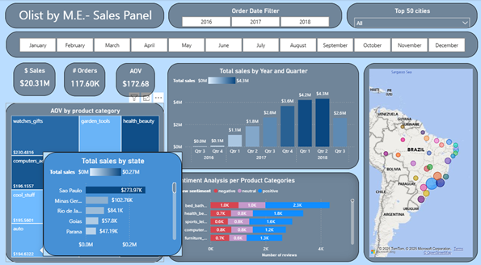

# Sentiment-Driven Sales & Delivery Analytics
**Ecommerce Analytics through:SQL Server → XLM-RoBERTa (multilingual sentiment) → Power BI**  
_100K+ Olist orders with Portuguese reviews_

> **Repo focus**
> - Built a pipeline from **SQL Server (SSMS)** to **XLM-RoBERTa sentiment** and **Power BI**, covering **100K+ orders** with multilingual reviews.
> - Built a **star schema** tying **sentiment scores** to **delivery** and **payments** (delay days, on-time %, carrier/region, installment mix) to **quantify rating impact**.
> - Shipped **Power BI dashboards** with clear **KPIs** and simple **risk alerts** (delay tail, score drop, price–sentiment lift).

---

## 1) End-to-End Flow

**Source CSVs → SQL Server views → Python sentiment → Power BI model → Dashboards**

**Stack**
- **SQL Server 2022** (tables + thin views to feed Power BI semantic model)
- **Python** with `cardiffnlp/twitter-xlm-roberta-base-sentiment`
- **Power BI Web Service**

**Steps**
1. Ingest Olist CSVs into SQL Server; cast types.
2. Create views via the sql code: `v_orders`, `v_order_items`, `v_order_revenue`, `v_payments`, `v_products`, `v_customers`.
3. Python: keep text in Portuguese, run **XLM-RoBERTa** → `sentiment_label` ∈ {neg, neu, pos}, `sentiment_int` ∈ {-1, 0, 1}.
4. Write results to a review-level table and load data model into Power BI. (All are done in .pbix file)
5. Link sentiment to delivery and payments in a **star schema**; build KPIs and alerts.

---

## 2) Data Model (Star Schema)

**ER sketch (paste your image):**  
``

---

## 3) Sentiment Pipeline (XLM-RoBERTa)

* Language: **Portuguese** (no translation required for the model).
* Model: `cardiffnlp/twitter-xlm-roberta-base-sentiment`.
* Output per review:

  * `sentiment_label`: `neg | neu | pos`
  * `sentiment_int`: `-1 | 0 | 1`
* Store as a fact table keyed by `order_id`.

**Notebook screenshot:**
Some parts of the python code:
```python
# ---- run
texts = reviews["review_comment_message"].tolist()
BATCH = 256
preds = []
for i in range(0, len(texts), BATCH):
    preds.extend(clf(texts[i:i+BATCH]))

#attach predictions
label_map = {"negative": -1, "neutral": 0, "positive": 1}
reviews["sentiment_label"] = [p["label"] for p in preds]
reviews["sentiment_score"] = [p["score"] for p in preds]
reviews["sentiment"] = reviews["sentiment_label"].map(label_map)

# cast review_score to numeric
reviews["review_score"] = pd.to_numeric(reviews["review_score"], errors="coerce")

# ---- save for Power BI ----
out_path = OUT_DIR / "olist_review_sentiment_pt.csv"
reviews.to_csv(out_path, index=False)
```
---

## 4) KPIs and Risk Alerts (Power BI)

**Core KPIs**

* **On-Time Delivery %** = on/at estimate ÷ delivered
* **Avg Delay Days** = mean `delivered_ts - purchase_ts`
* **Avg Review Score** (1–5)
* **Sentiment Mix** = % pos / neu / neg
* **Installment Mix** = share by `max_installments`
* **Payment Share** = credit card, boleto, debit, voucher
* **AOV** = revenue ÷ orders

**Example visuals (paste your images):**
`'
``
``
``
``

**Simple alert rules**

* **Delay Tail**: if `% orders with delay ≥ 20 days` > threshold → flag.
* **Score Drop**: if `Avg Review Score` falls ≥ X vs last 30 days → flag.
* **Price–Sentiment Watch**: `Avg Price` ↑ and `Neg %` ↑ in same window → flag.
* **Region Hotspot**: state/city with high delay and high neg sentiment → flag.

---

## 5) What We Quantify

* **Sentiment ↔ Delivery**: relate `sentiment_int` / `review_score` to **`delay_days`** and **on-time %** by state, carrier, and month.
* **Sentiment ↔ Payments**: score shifts by **payment type** and **installment depth**.
* **Rating impact**: show that **delay ≥ 20 days** aligns with a clear score drop.
* **Regional focus**: rank states/cities by **delay + negative sentiment** clusters.

**More visuals (paste your images):**
``
``

---

## 6) Reproduce 

**SQL Server (example view)**

```sql
CREATE VIEW dbo.v_order_revenue AS
SELECT
  oi.order_id,
  SUM(oi.price + oi.freight_value) AS order_revenue_brl
FROM dbo.order_items oi
GROUP BY oi.order_id;
```

**Python (outline)**

Refer to the 'notebooks' folder in the repo.

**Power BI**

* Import all views + `fact_reviews_sentiment`
* Set relationships per the **star schema**
* Add KPIs and alert rules above

---

## 7) Results Snapshot (one run)

* **Coverage**: ~**100K orders** (2016-10 → 2018-08)
* **On-Time Delivery**: ~**92%** overall
* **Delay effect**: scores near **4.0** for **< 20 days**, ~**3.0** for **≥ 20 days**
* **Payments**: **credit card** ≈ 75% of orders; visible **installment** usage
* **Single-item bias**: ~90% one-item orders → bundle and cross-sell can lift AOV

### 7-1)An exmaple: Yearly performance and category rotation

**SQL (CTEs + top-3 categories per year)**
```sql
;WITH y AS (
  SELECT 
    YEAR(o.purchase_ts) AS [year],
    SUM(r.revenue_brl)  AS sales_brl,
    COUNT(DISTINCT o.customer_id) AS customers,
    COUNT(DISTINCT o.order_id)    AS orders
  FROM dbo.v_orders o
  JOIN dbo.v_order_revenue r ON r.order_id = o.order_id
  WHERE o.order_status='delivered'
    AND o.purchase_ts >= '2016-01-01' AND o.purchase_ts < '2019-01-01'
  GROUP BY YEAR(o.purchase_ts)
),
cat AS (
  SELECT 
    YEAR(o.purchase_ts) AS [year],
    pr.product_category_name,
    SUM(oi.price + oi.freight_value) AS sales_brl
  FROM dbo.v_orders o
  JOIN dbo.v_order_items oi ON oi.order_id = o.order_id
  JOIN dbo.v_products     pr ON pr.product_id = oi.product_id
  WHERE o.order_status='delivered'
    AND o.purchase_ts >= '2016-01-01' AND o.purchase_ts < '2019-01-01'
  GROUP BY YEAR(o.purchase_ts), pr.product_category_name
),
cat_top AS (
  SELECT [year], product_category_name, sales_brl,
         ROW_NUMBER() OVER (PARTITION BY [year] ORDER BY sales_brl DESC) AS rn
  FROM cat
)
SELECT 
  y.[year],
  CAST(y.sales_brl AS decimal(18,2)) AS sales_brl,
  CAST(y.sales_brl / NULLIF(@brl_per_usd,0) AS decimal(18,2)) AS sales_usd,
  y.customers,
  y.orders,
  (
    SELECT STRING_AGG(product_category_name, ', ') 
           WITHIN GROUP (ORDER BY sales_brl DESC)
    FROM cat_top t
    WHERE t.[year]=y.[year] AND t.rn<=3
  ) AS top3_categories_by_revenue
FROM y
ORDER BY y.[year];
````

**Result table**

| year |  sales_brl | sales_usd | customers | orders | top3_categories_by_revenue                           |
| ---: | ---------: | --------: | --------: | -----: | ---------------------------------------------------- |
| 2016 |     74,280 |    14,285 |       312 |    388 | furniture_decor, perfumery, health_beauty            |
| 2017 |  9,160,000 | 1,761,538 |    43,430 | 43,430 | bed_bath_table, computers_accessories, health_beauty |
| 2018 | 11,070,000 | 2,128,846 |    53,780 | 63,680 | health_beauty, bed_bath_table, computers_accessories |

**Quick read**

* Clear step-up from 2016 → 2017 and again into 2018 YTD.
* Category leaders rotate across **bed_bath_table**, **health_beauty**, **watches/gifts**, and **computers_accessories**.

---

## 8) Files

* `sql/queries.sql` — SQL build + views
* `notebooks/sentiment_xlmr.ipynb` — sentiment labeling
* `powerbi/Dashboard.pbix` — model + visuals
* `/img/...` — result images

---

## 9) Data and License

* Data: **Brazilian E-Commerce Public Dataset by Olist** (Kaggle).
* Follow dataset terms when using the repo.


```
```
